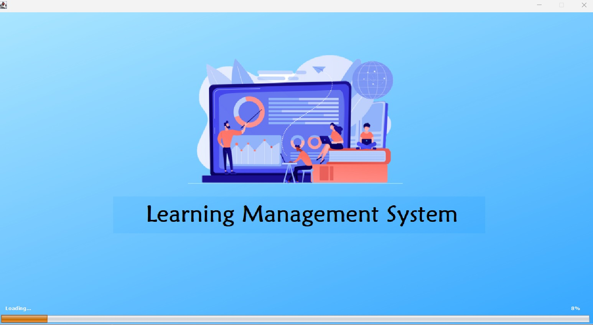
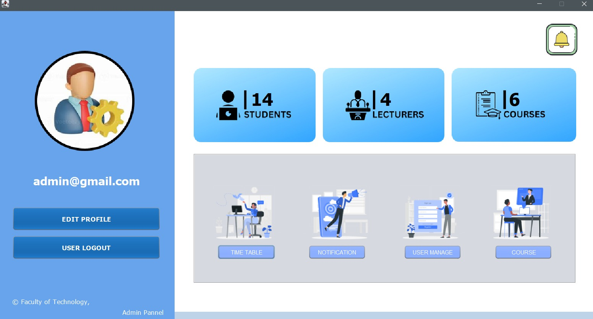
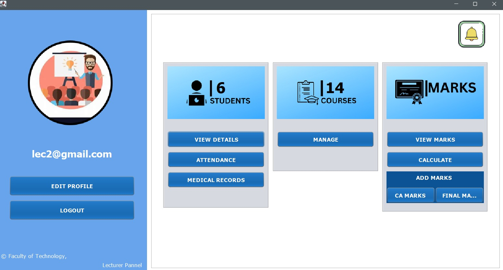
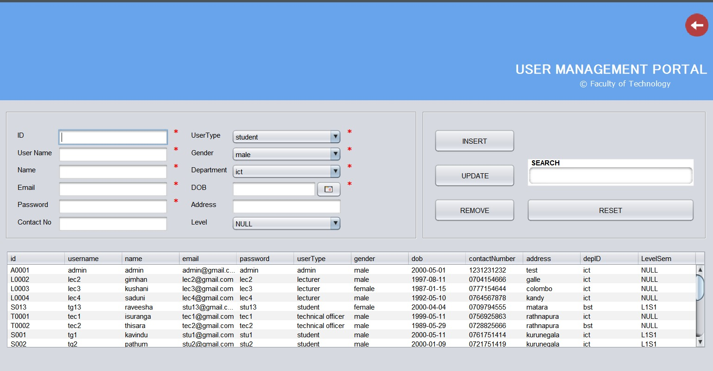
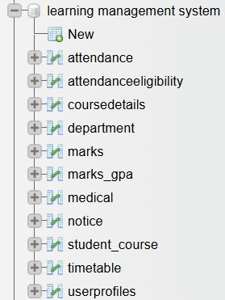

# University Learning-Management-System

A Java-based University Management System implementing core features like student registration, course and faculty management, and user authentication. Designed to demonstrate clean, modular, and maintainable code with full database integration.

## Features
- Student registration and management
- Course creation, update, and deletion
- Faculty management
- Enrollment tracking
- User authentication system

## Technologies Used
- Java (Core Java with JDBC)
- MySQL Database
- Git for version control

## Highlights
- Applied Object-Oriented Design Principles to ensure modular, maintainable architecture.
- Integrated with MySQL via JDBC to perform robust CRUD operations.
- Managed complete Software Development Lifecycle (SDLC): requirements analysis, design, implementation, testing, validation, and documentation.
- Wrote clean, efficient, and reusable code adhering to software quality engineering best practices.
- Automated database setup and initial data population with SQL scripts.

## 📸 Screenshots/ Results

### Home page

### Admin Home page

### Lecturer Home page

### Admin access to user managment database

### Categories

## How to Run
1. Clone the repository:
2. Import the project into your IDE (e.g., IntelliJ, Eclipse).
3. Set up the MySQL database using the provided SQL scripts.
4. Update database connection settings in the code as needed.
5. Compile and run the Java application.

